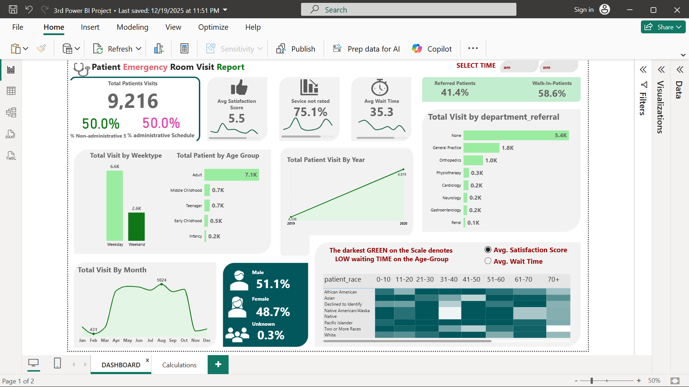

# 🏥 Patient Emergency Room Visit Report — Power BI Healthcare Dashboard

> **Power BI | Healthcare Analytics | DAX | UI/UX Design**  
> **Author:** Awwal | **Project:** 3rd Power BI Project | **Status:** Completed ✅

---

## 📌 Project Overview

This is an **executive-level healthcare analytics dashboard** built in Power BI for a hospital's **Emergency Room (ER)**.

It transforms raw patient data into clear, actionable insights — helping hospital management understand patient flow, wait times, satisfaction scores, and department performance at a glance.

---

## 🖼️ Dashboard Preview



---

## 📊 Key Metrics at a Glance

| Metric | Value |
|--------|-------|
| 🏥 Total Patient Visits | 9,216 |
| ⭐ Avg Satisfaction Score | 5.5 |
| ⏱️ Avg Wait Time | 35.3 mins |
| 📋 Service Not Rated | 75.1% |
| 👥 Referred Patients | 41.4% |
| 🚶 Walk-In Patients | 58.6% |

---

## 🏗️ How This Project Was Built

### 1. 🔌 Data Acquisition & Quality
- Connected to a **healthcare CSV dataset** using Power Query
- Investigated data quality issues and handled **null/missing values**
- Ensured clean, accurate data before any analysis

### 2. 🤖 AI-Powered Data Understanding
- Used **Generative AI** to build a **data dictionary**
- Decoded cryptic column names like `Patient Admin Flag`
- Sped up understanding of unfamiliar healthcare data fields

### 3. 🔄 Data Transformation (Power Query)
- Extracted **AM/PM from Arrival Time** column
- **Merged patient name** fields into one clean column
- Formatted dates for proper time intelligence

### 4. 📐 DAX Measures & Logic

| Measure | Purpose |
|--------|---------|
| Total Patient Count | Total ER visits |
| Admin Schedule % | % of administrative vs non-admin visits |
| Age Category Bucketing | Groups patients: Infancy, Early Childhood, Teenager, Adult, etc. |
| Avg Satisfaction Score | Average patient satisfaction rating |
| Avg Wait Time | Average time patients waited |

### 5. 📊 Data Visualization
- **KPI Cards** — instant snapshot of key hospital metrics
- **Heat Map** — patient race vs age group with satisfaction/wait time colour scale
- **Field Parameters** — toggle between Avg Satisfaction Score and Avg Wait Time
- **Bar Charts** — visits by department referral
- **Line Charts** — total visits by month and by year
- **Dynamic Min/Max Markers** — highlights best and worst performing months

### 6. 🎨 UI/UX Design
- Modern layout built with **PowerPoint-style containers**
- **Flat icons** for a professional, clean look
- **Custom slicers** — AM/PM time selector
- Green-themed colour palette for a medical feel
- Designed to look like a **real hospital executive report**

---

## ✨ Dashboard Features

- 🕐 **AM/PM Time Filter** — compare day shift vs night shift visits
- 👨‍👩‍👧 **Gender Breakdown** — Male 51.1% | Female 48.7% | Unknown 0.3%
- 📅 **Monthly Trend** — spot peak months (August: 1,024 visits)
- 🏥 **Department Referral Analysis** — None, General Practice, Orthopedics, Cardiology, and more
- 🌍 **Race & Age Group Heat Map** — deep demographic insights
- 📆 **Year-over-Year Growth** — 2019 vs 2020 patient visits

---

## 🛠️ Tools & Skills Used

- **Microsoft Power BI Desktop**
- **Power Query** — data cleaning and transformation
- **DAX** — custom measures and calculated columns
- **Generative AI** — data dictionary creation
- **PowerPoint** — dashboard UI containers and layout design

**Skills:** Data Analytics · Data Science · Healthcare Analytics · Data Visualization · DAX · Power Query

---

## 📁 Repository Structure

```
📂 patient-er-dashboard-powerbi/
├── 3rd_Power_BI_Project_Awwal.pbix   ← Power BI Dashboard file
├── dashboard.png                      ← Dashboard screenshot
└── README.md                          ← Project documentation
```

---

## 🚀 How to Open

1. Install [Power BI Desktop](https://powerbi.microsoft.com/desktop/) — it's free
2. Download the `.pbix` file from this repository
3. Open Power BI Desktop → **File → Open** → select the file
4. Interact with the full dashboard!

---

## 💡 Business Value

This dashboard helps hospital management:
- Monitor ER visit volumes and spot seasonal trends
- Identify which departments receive the most referrals
- Track patient satisfaction and reduce wait times
- Understand demographic patterns across age groups and race
- Compare weekday vs weekend visit patterns

---

## 👤 About Me

I'm **Awal**, a passionate learner on a journey into **Data Science and AI engineering**

## 📅 Completed

December 2025

---

*⭐ If this project helped or inspired you, please star this repository!*
